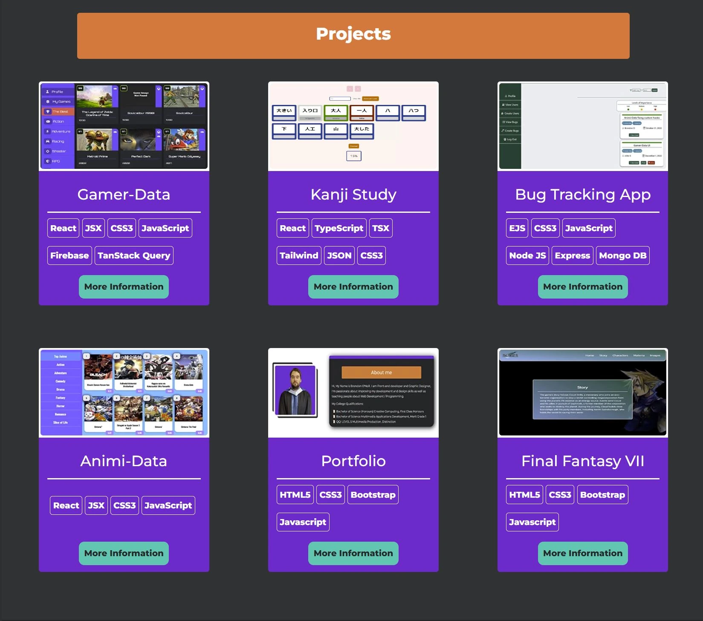

# Portfolio-Revamp

This is a revamp of my old Wix portfolio where I used Wix to create a website to display my projects and designs as my html and css wasn't the best leaving college. This updated Portfolio is created on the bootstrap framework but most of the css is custom as I wanted to see how far my html, css and JavaScript have improved over the past year. I also wanted to display my digital designs in a gallery to display my work in one place

## Tools

- HTML
- CSS
- JavaScript

## Deployment

The site is deployed on [GitHub Pages](https://brendononeill.github.io/Portfolio-Revamp/)

## Preview

Few Screenshots of the app.




Here is how I deal with Light / Dark mode as the page loads

```javascript
window.addEventListener("load", (e) => {
  if (
    localStorage.getItem("light") === null &&
    localStorage.getItem("dark") === null
  ) {
    localStorage.setItem("dark", true);
  } else if (localStorage.getItem("light")) {
    themeChange();
    image.src = "images/sun.svg";
  }
});

function themeChange() {
  if (localStorage.getItem("light")) {
    image.src = "images/sun.svg";
    darkToggle.classList.toggle("toggle-light");
    darkToggle.classList.remove("toggle-dark");
    document.documentElement.setAttribute("data-theme", "light");
  } else {
    image.src = "images/moon.svg";
    darkToggle.classList.toggle("toggle-dark");
    darkToggle.classList.remove("toggle-light");
    document.documentElement.setAttribute("data-theme", "dark");
  }
}
```

## Lessons learned

I have re-created this site many times as I have improved my HTML & CSS skills and had different vision of how to sell my skill set. I have learnt new best practices and how to structure my site better.

I learnt a lot about Accessibility and understanding validation (Like your not meant to put px on images in html).

## Working on
Updating the bug tracking app with the new front end. 

## Potential future features
- Clean up next js project and add to projects. 

- Add more projects and designs
- Make more custom styled cards to show off my css


## Working on


- Making the site more accessible

## Known Bugs
- new image need resizing plus scaling of images on site 

